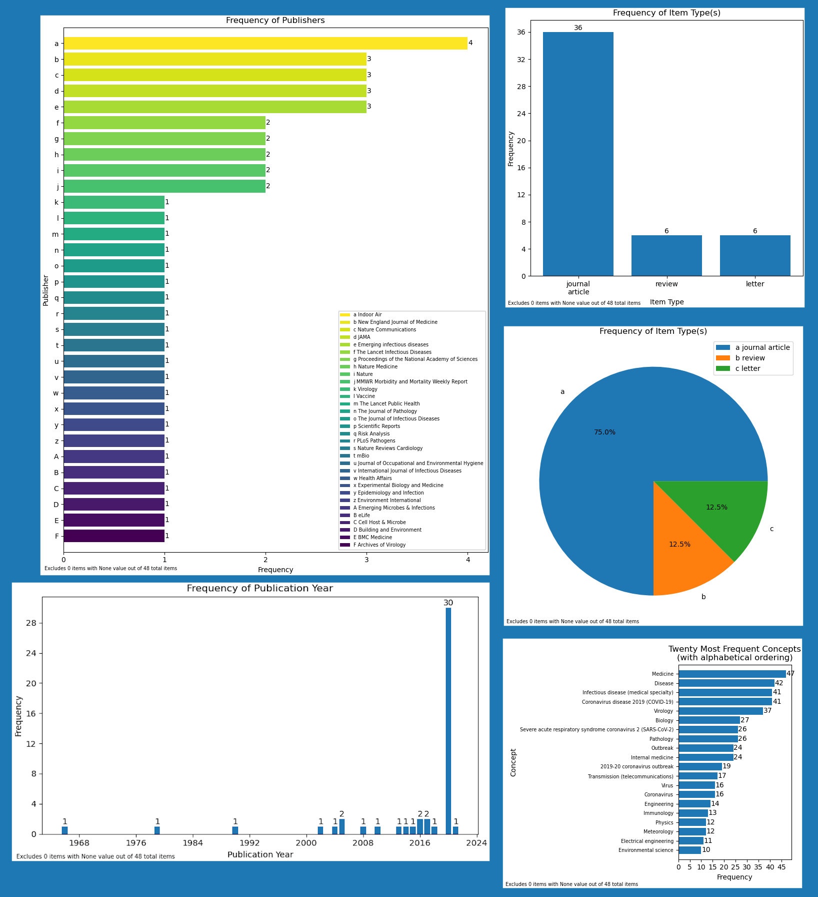

# Example use of the Computable Bibliography

The following images were generated using the Computable Bibliography. 
The DOI file used for generation can be downloaded below; it is taken from a workshop
held by the National Academies of Science, Engineering, and Medicine in August 2020 on airborne
transmission of SARS-CoV-2. [Workshop page viewable here.](https://www.nationalacademies.org/our-work/airborne-transmission-of-sars-cov-2-a-virtual-workshop#sectionPublications)

These visualizations give insight into the overall recency of the topic under investigation, as well as the wide variety of
journals cited and disciplines represented. Overall, this exemplifies recent, still-fluctuating knowledge creation.

- Top left shows journal frequency
- Bottom left shows year distribution
- Top right and center right show publication type frequency
- Bottom right shows concept frequency

<a id="raw-url" href="">Download example DOI file.</a>
